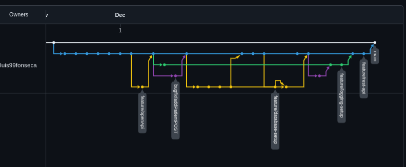

# Hospital-Consultation-Management-System
Solution Proposal for the Challenge "Pharma Backend Challenge"

## About the Project
### Structure
```agsl
Hospital-Consultation-Management-System/
├── docker-setup/                   # Docker-related files
│   ├── application/
│   │   └── Dockerfile.postgres
│   ├── postgres/
│   │   └── Dockerfile.springboot
│   └── docker-compose.yml
├── hospital-consult-management/    # Java project
│   ├── src/
│   │   ├── main/
│   │   └── test/
│   ├── pom.xml
│   └── target/                     # Folder where artifacts are generated
└── example-requests/               # Folder containing request examples
└── readme-files/
└── build_and_run.sh                # Script to load and run the application
└── stop_compose.sh                 # Script to stop the application
```

## How to Run
A script named `build_and_run.sh` was created to handle the building of the Docker images and then start them as containers. To run this project, you only need to run this script.

**Note:** `docker`, `docker-compose`, and `mvn` are required for this step. Also, make sure this script has the necessary permissions to be run.

**Note 2:** The database is preloaded with the sample data as requested in the challenge description. An SQL-based solution was chosen, specifically with a Postgres implementation.

#### How to Stop
To stop the entire application, simply run the script `stop_compose.sh`.

**NOTE:** Simply pressing CTRL+C is not enough to stop the application. This script SHALL be run.

### Endpoints
#### Swagger
You can check the REST API's endpoints by accessing the page: http://localhost:8080/swagger-ui.html

#### Interaction
Interaction with the system is done by issuing REST API requests to the application at the `http://localhost:8080` endpoint. Examples of requests can be found in the `example_requests/` folder. This folder contains files with sample cURL commands that are ready to be executed, as well as a Postman-ready JSON file that can be imported for the same purpose.


### Development
Development was done using Git, specifically GitHub, in a feature-branch-based style of development. An overview of the network can be found at Insights/Network.

**Note:** The image does not show the final iteration.

### Limitations
Due to time constraints, there were several points that were impacted, namely:
- Test coverage: The number of (unit) tests developed was reduced and only covers the core parts of the code. Therefore, scenarios like edge cases were not considered, and as the project's size increased, test development was halted to meet the developer's time constraints.
  - Integration tests: Although it wasn't required for the project initially, integration tests (IT tests) would be very important to ensure the quality and robustness of the code.
  - Performance tests: Not created either.
- Log centralization: Was not integrated due to time constraints.
- Customization: Since it was out of the project's scope, there is no customization for either service regarding variables (ports, credentials, etc.).
- Profiles: Due to issues in profile configuration, this functionally was not fully employed.
